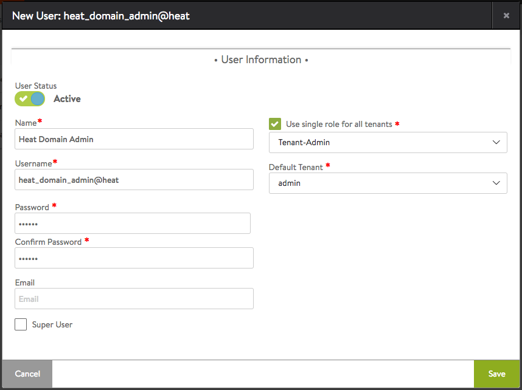
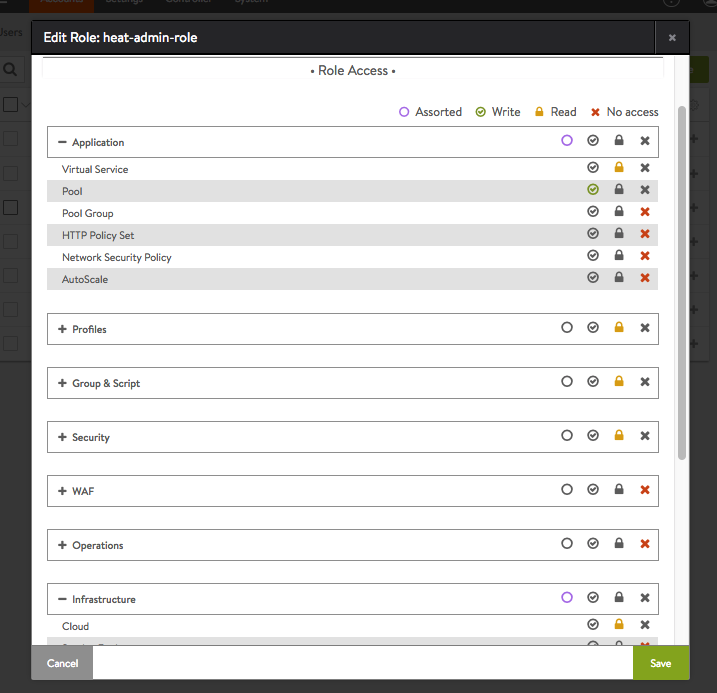

Avi Heat Resources
------------------

Heat resources for Avi Objects

.. contents:: Table of Contents

Installation Steps
==================

1. Install the AviHeat PIP Package from https://github.com/avinetworks/avi-heat/releases

2. Update your /etc/heat/heat.conf and add the following in the [Default] section:

   Ubuntu::

    plugin_dirs = '/usr/local/lib/python2.7/dist-packages/avi/heat'

   RHEL::

    plugin_dirs = '/usr/lib/python2.7/site-packages/avi/heat'

3. Provide the IP address or FQDN for the Avi Controller. Use one of the following options:

   OPTION 1: In heat.conf
     Update your /etc/heat/heat.conf and add the following in the [Default] section:

   ::

       avi_controller = '10.10.25.200'

   OPTION 2: Via avi-lbaas service in keystone catalog
     Please refer to Avi Knowledge Brief at https://kb.avinetworks.com/installing-the-lbaas-driver-cli-shell-openstack/ for details on how to define avi-lbaas service and an endpoint for it in your keystone catalog.

4. Restart heat-engine after adding this. For example::

    $> service heat-engine restart

5. For implementing AutoScalingGroup, Heat engines use the credentials configured under
stack_domain_admin variable /etc/heat.conf. So, an AutoScalingGroup with template
containing Avi resouces will work only if the Heat Engine can login to Avi Controller
using those same stack_domain_admin credentials.

For example, consider the following settings in /etc/heat.conf::

    ...
    stack_domain_admin = heat_domain_admin
    stack_domain_admin_password = abc123
    ...

In this case, you need to create a user named "heat_domain_admin" on Avi Controller
using the same password as defined
in the heat.conf. 
We recommend granting this user Tenant-Admin role in all tenants so that any
Avi resource can be created, updated, or deleted via the templates used in
AutoScalingGroup. However, if this is deemed a security issue, you can create
a new role in Avi with specific privileges and assign only that role to this
new user.

The following picture shows how to create such
user in Avi UI.

Alternatively, you can perform a POST API for /api/user URI with the following data
(role_ref needs to be replaced with the url corresponding to the Tenant-Admin role)::
    {
        "username": "heat_domain_admin",
        "password": "abc123",
        "full_name": "Heat Domain Admin",
        "is_active": True,
        "access": [{"all_tenants": True,
                    "role_ref": role_ref}],
        "default_tenant_uuid": "admin",
        "require_password_confirmation": False,
    }

The following picture shows a more restricted custom role on Avi that only allows
write access to the Pool resource. By assigning such a role to the stack_domain_admin user
instead of Tenant-Admin role, one can allow an AutoScalingGroup to automatically
add members to a group, but not allow write access to any other objects in the system.

Usage Notes
===========

Once installed, Heat will expose Avi resource types that users can specify in their heat templates.
For a full list of resource types, use the following command::

    $> heat resource-type-list | grep Avi
    ...
    | Avi::LBaaS::Pool                          |
    | Avi::LBaaS::Pool::Server                  |
    | Avi::LBaaS::Role                          |
    | Avi::LBaaS::SSLProfile                    |
    | Avi::LBaaS::SeProperties                  |
    ...

For a full list of attributes available for any resource type, use the following command::
 
    $> heat resource-type-show Avi::LBaaS::Pool
    ...
     "properties": {
       "lb_algorithm": {
         "description": "The load balancing algorithm will pick a server within the pool's list of available servers.", 
         "required": false, 
         "update_allowed": true, 
         "type": "string", 
         "immutable": false, 
         "constraints": [
           {
             "allowed_values": [
               "LB_ALGORITHM_ROUND_ROBIN", 
               "LB_ALGORITHM_LEAST_LOAD", 
    ...

For properties that need UUIDs, you can specify a name but prefixed with string "get_avi_uuid_by_name:"::

    ...
    member:
      type: Avi::LBaaS::Pool::Server
      properties:
        pool_uuid:  get_avi_uuid_by_name:testpool
    ...

Internally, heat-engine would perform an API call to resolve the provided name into Avi UUID.
For a complete example, please refer to test-member.yaml in examples directory: https://github.com/avinetworks/avi-heat/blob/master/examples/test-member.yaml.

If you want to provide the name for a UUID property via an input parameter to your template,
please refer to the example in test-member-pool-as-param.yaml: https://github.com/avinetworks/avi-heat/blob/master/examples/test-member-pool-as-param.yaml::

    ...
    parameters:
     pool_name:
       type: string
    ...
    resources:
     member:
       type: Avi::LBaaS::Pool::Server
       properties:
         pool_uuid:
           str_replace:
             template: get_avi_uuid_by_name:pname
             params:
               pname: { get_param: pool_name }
    ...

Versioning
~~~~~~~~~~

Starting version 17.1.X, Avi Vantage supports API versioning and backwards compatability.
Avi Heat plugin leverages this backwards compatability. Thus, any
heat template written for a version of Avi Vantage continues to work even when the Avi
Vantage software or the Avi Heat plugin is updated to a later version.

For each Avi Resource, any attribute that is newly introduced in a specific version
is noted with phrase "(Introduced in: <version>)" in the description of that attribute.
Similarly, phrase "(Deprecated in: <version>)" denotes the version a specific attribute
is deprecated in. An attribute that doesn't have either of those notations is available
is valid across all versions.

Each Avi Resource has a special attribute called "avi_version", that can be used by the users
to explicitly specify a version to use when creating that resource. When no version is
specified, the resource definition can only use those attributes that don't have "Introduced in"
annotation in their descriptions. To be able to use attributes with "Introduced in"
annotation, one has to set the "avi_version" attribute to a version equal to or higher
than the version mentioned in the "Introduced in" annotation. For example, if an
attribute has "(Introduced in: 17.1.3)" annotation in the description, then
the "avi_version" attribute has to be set to either "17.1.3" or higher (e.g., "17.1.6" or "18.1.2").

Note that once the "avi_version" attribute of a resource is set, all attributes of that
resource that are deprecated in a version equal to or lower than that version can not
be used in that resource's definition in that template.

Consider the following example snippet for using Avi::LBaaS::VirtualService resource type::

    ...
    vs:
      type: Avi::LBaaS::VirtualService
      properties:
        name: "mytestvs"
        pool_uuid: {get_resource: pool}
        ip_address:
          addr: 10.10.10.100
          type: V4
        services:
          - port: 80
    ...

The above does not use any attributes with "(Introduced in: <version>)" annotation in their
descriptions. Hence, the resource doesn't need to have the "avi_version" attribute set. Suppose
you want to use the concept of shared VIPs introduced in Avi Vantage version 17.1.1. The
following template shows the exact same VirtualSerice definition as above but using the
attribute "vip" that is only available from versions 17.1.1 and beyond::

    ...
    vs:
      type: Avi::LBaaS::VirtualService
      properties:
        avi_version: 17.1.1
        name: "mytestvs"
        pool_uuid: {get_resource: pool}
        vip:
          - ip_address:
              addr: 10.10.10.100
              type: V4
            vip_id: myvip
        services:
          - port: 80
    ...

